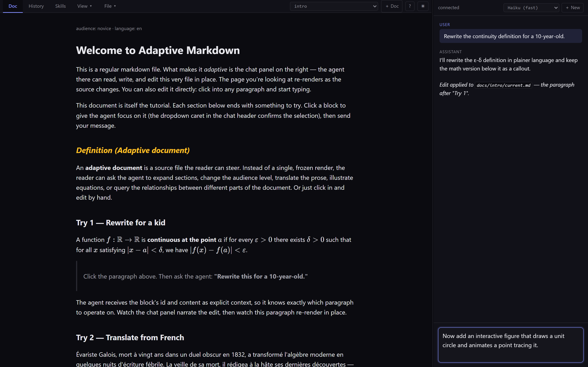

# Adaptive Markdown

**A document shouldn't have to stay static.** It should be something a coding agent can extend, reshape, and turn into an interactive workspace.

This is not a canvas you edit with a chatbot. The document itself becomes both the source of truth and the programmable interface — a living app. You write the document, drop in your data, keep your notes, and then tell a coding agent what you want the surface to become. The agent edits the file directly: adds charts, restyles sections, builds calculators, imports data, generates summaries, turns static notes into interactive tools.

A single `.md` file holds the text, data, styling, interactivity, history, and agent instructions together. Open it in any markdown viewer and it reads as a normal document. Open it in this viewer and it becomes the app.

Most agent-driven editing tools box the agent into a fixed component palette — it can rewrite text or fill in a sandboxed widget. **Here it has the full web platform**: every CSS rule, every `<script>` tag, every API the browser exposes. The output is still a normal `.md` file you can share, fork, and check into git. Dark mode toggle, animated headings, a snake game in the corner — all by asking, all stored as plain markdown.

**Example.** Start with a fitness log — just a plain markdown journal. Ask the agent to chart your weekly volume. Ask it to import a Garmin export. Ask for rolling averages, weekly summaries, goal tracking, an export-to-CSV button. The document doesn't move *into* an app. It *becomes* the app.

Instead of juggling a document, a spreadsheet, a dashboard, a separate AI chat, and a changelog for each, you have one living file with all those layers in it.



## Quick start

```bash
git clone https://github.com/SemiSimpleMath/Adaptive-Markdown
cd Adaptive-Markdown
pip install -r requirements.txt
python start.py --claude
```

Open <http://127.0.0.1:8090>. On first launch the viewer shows a setup card — paste your [Anthropic API key](https://console.anthropic.com/settings/keys) and you're talking to your document right away (the card writes the key to `.env` and restarts the runtime for you — no manual restart). Detailed per-OS install + Codex alternative are [below](#install).

> ▶ See it in motion on YouTube: [demo 1](https://youtu.be/H4MnFs8irm8) · [demo 2](https://youtu.be/xf6jxf-hyP4)

## What it can do

The agent has the full web platform; the doc has the full filesystem. Some of what falls out:

- **Live figures** — drop a `.csv` and get a sortable, filterable Tabulator grid. Drop a `.abc` / `.musicxml` / `.mid` and get notation + playback. Drop a `.mmd` and get a Mermaid diagram. All authored as `<figure>` blocks the agent can rewrite.
- **Custom widgets** — calculators, sliders, dark-mode toggles, transpose controls, anything you'd build with HTML + CSS + JS. The agent writes them as inline `<script>` blocks.
- **Inline editing** — hover a paragraph or heading and click the ✎ to edit its **markdown source** in place, then save and it re-renders. Because you edit the source (not the rendered view), styled spans, math, and inline formatting round-trip exactly — nothing is lost in a DOM→markdown reconstruction. Use Source view for lists, code, and tables.
- **Click-to-focus** — click a paragraph, theorem, or figure to focus the agent on that block. `Shift+click` for multi-select; `Alt+click` to escalate to the parent (e.g., the wrapping collapsible section).
- **Per-doc skills** — every doc can carry its own `<section class="agent-skill">` blocks: voice rules, format conventions, domain facts. The agent reads them as authoritative for that doc; readers don't see them.
- **History & restore** — every pre-edit state is snapshotted automatically. Browse, restore, undo, or pin the current state as a new baseline.
- **Themes** — light, dark, system. The whole chrome and the doc body both theme together; live-renderer canvases (music, data, diagrams) stay readable in both.
- **Export & print** — single self-contained `.html` for sharing (no AM needed to open it), or PDF / printer with proper page flow.
- **File drops** — `.md` loads directly. `.pdf` / `.docx` / `.xlsx` / `.pptx` / `.tex` / `.rst` / `.org` convert to AM via server-side or vision-model paths.
- **Built-in help** — `?` button in the toolbar opens an in-app guide.

## Why `.md`?

**The file is the source, not the build output.**

HTML is what browsers render; markdown is what humans (and agents) write. Editing in markdown is roughly 10× less syntactic noise per change than maintaining HTML — `## Theorem` instead of `<h2 class="theorem">…</h2>`, `**bold**` instead of `<strong>…</strong>`, `- item` instead of `<ul><li>…</li></ul>`. The agent makes fewer mechanical mistakes, turns finish faster, the file you commit reads as prose rather than tag soup.

When the doc needs to reach for the platform — a chart, a custom widget, scoped CSS, an interactive figure — you drop HTML / CSS / JS inline. The escape hatch is always there. But that's the escape hatch, not the primary mode.

Net: your file stays portable. Open it in GitHub, Obsidian, VS Code's preview, `mdcat` in a terminal, a markdown-rendering iOS app — it reads as a normal document. Pipe it through pandoc for LaTeX, ePub, DOCX, or a static-site generator. The AM viewer is what makes the doc *adaptive*, but its absence doesn't trap your content: every other markdown tool on earth can still read what you wrote. The .md is the artifact you keep; AM is the runtime that brings it to life.

---

## Prerequisites

- **Python 3.10+**
- An **Anthropic API key** for the default (Claude) runtime — get one at [console.anthropic.com](https://console.anthropic.com). The Claude Agent SDK draws from your API credits, not your Claude.ai subscription.
- *(Optional)* The **Codex CLI** installed, plus **either** an **OpenAI API key** **or** a logged-in ChatGPT account, for the experimental Codex runtime — see [Picking the runtime](#picking-the-runtime) below.
- A modern browser (Chrome / Edge / Firefox / Safari).

## Security & responsible use

This tool runs a capable coding agent on your local machine with access to a document you load. **Treat this like running someone else's code locally** — because that's effectively what every chat turn is.

- **Use it with documents you authored or fully trust.** Document content becomes part of the agent's context. A malicious markdown or LaTeX file can include hidden instructions — natural-language prompt injection — aimed at the agent. Dropping in a `.md` you found on a sketchy corner of the internet is the same risk class as `curl … | bash`. When you drop a non-markdown file for conversion, the viewer shows the first 2KB in a preview dialog before sending it to the agent; skim for unexpected instructions before clicking "Send to agent."
- **The agent's write scope is constrained to `docs/<slug>/current.md`.** `baseline.md` (the immutable history-0), `snaps/` (pre-edit captures), project source files, configuration, `.env`, and anything outside the doc tree are all rejected (Claude mode: pre-edit hook; Codex mode: post-turn revert from snapshot). The iframe rendering your doc loads from a different origin than the viewer (`localhost` vs `127.0.0.1`); same-origin policy blocks it from reading the parent page or the local backend even though it has `allow-same-origin` (which only grants access to *its own* storage, needed for YouTube / CodePen / Observable embeds). The backend's static file route only serves the favicon and the `current.md` / `baseline.md` per doc folder — `.env`, snapshot files, and sidecar JSON return 404. WebSocket and POST endpoints check the request `Origin` and reject cross-origin callers.
- **The agent has shell access — sandboxed by default.** Reaching for `Bash` unlocks structured-data work that pure text editing can't do ergonomically: transposing MusicXML, pivoting CSV, resizing images, converting audio. The sandbox is **on automatically** when you run `python start.py --claude` (or `--codex`); no flag, no config. On macOS / Linux / WSL2 the Claude CLI's built-in sandbox closes network and syscall-filters file access. On Windows we wrap each `Bash` call in a subprocess with curated env (API keys stripped), scoped cwd (`docs/<slug>/`), and timeout — best-effort given the Windows constraints, with env curation as the load-bearing layer (a prompt-injected agent has nothing to exfiltrate). `WebFetch` is denied on both platforms; if a task needs the open internet, drop the file in instead. Power-user opt-out exists but is rarely needed: `python start.py --unsafe-bash` disables the sandbox on either platform. WSL2 is the recommended host if you ever turn the sandbox off — the WSL VM boundary contains an unrestricted agent better than the Windows host does. The opt-out is out-of-band only; nothing in chat can enable it.
- **Defenses are not perfect.** Prompt injection that convinces the agent to "translate this text" where the text is actually a covert instruction is still a real risk class — the document is *content* and the agent reads all of it. The **History** tab captures pre-edit snapshots; check it after any turn that didn't go as expected.
- **Codex mode has a wider in-project blast radius than Claude.** Codex's CLI sandbox makes the entire project root writable and its hook system can't gate file edits today, so we run a post-turn validator that detects and reverts unauthorized writes from snapshot. The bytes briefly hit disk during the turn before being reverted; you'll see a warning in chat if this fires. Network egress is disabled in both modes by default.
- **This software is provided AS-IS** per the [MIT license](LICENSE). The authors assume no responsibility for misuse, data loss, or unexpected agent behavior. Use at your own risk.

## Install

### Linux / macOS

```bash
git clone https://github.com/SemiSimpleMath/Adaptive-Markdown
cd Adaptive-Markdown

python -m venv .venv
source .venv/bin/activate

pip install -r requirements.txt
```

### Windows (PowerShell)

```powershell
git clone https://github.com/SemiSimpleMath/Adaptive-Markdown
cd Adaptive-Markdown

python -m venv .venv
.venv\Scripts\activate

pip install -r requirements.txt
```

## Configure

Copy `.env.example` to `.env` and fill in the keys for the runtime(s) you want.
The two providers' env vars don't overlap, so a single `.env` can hold both —
the `--claude` / `--codex` flag at launch picks which runtime reads them.
Shell environment variables always win over `.env`.

**Claude (default, supported)** — same on every platform:

```ini
# in .env
ANTHROPIC_API_KEY=sk-ant-...
```

**Codex (experimental) — Linux / macOS:** `codex` is typically on PATH after
install, so you usually only need auth and model:

```ini
# in .env
CODEX_AUTH_MODE=chatgpt        # or omit and set OPENAI_API_KEY for api-key mode
CODEX_MODEL=default
```

**Codex (experimental) — Windows:** the installer doesn't usually add `codex.exe`
to PATH, so set `CODEX_COMMAND` explicitly:

```ini
# in .env
CODEX_COMMAND=C:\Users\you\AppData\Local\OpenAI\Codex\bin\codex.exe
CODEX_AUTH_MODE=chatgpt        # or omit and set OPENAI_API_KEY for api-key mode
CODEX_MODEL=default
```

**Want both available?** Put both blocks in `.env`. Each runtime ignores the
other's variables; you toggle at launch with the flag.

## Run

The same launcher command works on every platform. The first time, pick a
runtime with `--claude` or `--codex` — the choice is remembered in a local
`.am-provider` file for subsequent runs:

```bash
python start.py --claude       # first time: pick Claude
python start.py --codex        # first time: pick Codex
python start.py                # subsequent runs: use whatever was last picked
python start.py --port 9000    # any of the above + custom port
```

Open <http://127.0.0.1:8090> in your browser. The tutorial doc loads by default.

That's it — **the agent's `Bash` tool is sandboxed automatically** with no flag needed. On macOS / Linux / WSL2 the Claude CLI's built-in sandbox handles it (network namespace + syscall filter); on Windows a subprocess wrapper (curated env / scoped cwd / timeout) kicks in via a PreToolUse hook. See [Security & responsible use](#security--responsible-use) for the threat model.

Power-user opt-out (rarely needed): `python start.py --unsafe-bash` disables the sandbox entirely on whichever platform you're on. Only use in a workspace you fully trust. WSL2 is the recommended host for this mode because the WSL VM boundary bounds blast radius even with the agent unrestricted; running unsafe-bash on the Windows host directly gives the agent your full user account.

## Picking the runtime

**Claude mode** (`--claude`) is the supported path. Runs the Claude Agent SDK in-process with per-edit snapshots via the SDK's hook system and a per-turn budget cap (`MAX_BUDGET_USD`, default $3/turn — raise via `.env` for Opus-heavy workflows).

**Codex mode** (`--codex`) is experimental and wraps OpenAI's `codex exec` CLI. Substrate parity (history snapshots, alias bookkeeping, network-off default) is in place, but with coarser per-edit granularity, a wider in-project blast radius covered by post-turn revert, no per-turn budget cap, and conversation history replayed via prompt. See [`ROADMAP.md`](ROADMAP.md) for the full list of known gaps. Requires the Codex CLI installed; set `CODEX_COMMAND` if it isn't on PATH (usually only needed on Windows).

The runtime is captured at backend start, so switching providers requires a restart (`python start.py --claude` / `--codex`). You can keep both providers' keys in `.env` simultaneously — the flag is the only thing that decides which runtime reads them.

## First run — the tutorial

`docs/intro/baseline.md` is itself the tutorial (the working copy gets restored from it via Reset). It has four interactive sections:

1. **Rewrite for a kid** — click an ε-δ continuity definition, ask the agent to rewrite it for a 10-year-old.
2. **Translate from French** — click a paragraph about Évariste Galois, ask to translate.
3. **Add a figure** — click the unit-circle section, ask the agent to animate a point tracing it.
4. **Change the page itself** — ask for a dark-mode toggle, animated headings, or falling letters. The agent writes a literal `<script>` block into the markdown source.

Open **View ▾ → Source** afterwards to see exactly what got added — no hidden framework, no component palette. Just markdown with embedded `<style>` and `<script>`.

## Configuration

For the common case, `python start.py --claude` / `--codex` is the simplest
way to pick a runtime. The env vars below are for finer control — model
selection, budget caps, Codex auth mode, port override.

Environment variables (all optional):

| Variable | Provider | Default | Purpose |
|---|---|---|---|
| `ANTHROPIC_API_KEY` | Claude | (required for `--claude`) | Your Anthropic API key. |
| `MODEL` | Claude | `claude-haiku-4-5-20251001` | Claude default model. Override with a full SDK model id, or use the chat dropdown to switch between Haiku / Sonnet / Opus per session. |
| `MAX_BUDGET_USD` | Claude | `3.0` | Per-turn budget cap (USD). The SDK aborts a turn if costs would exceed it; the viewer surfaces a clear chat error when this happens. Raise for Opus on large docs (a single Opus turn on a ~30KB doc can easily hit $1+). |
| `CODEX_COMMAND` | Codex | `codex` | Codex executable name or path. Set this if `codex` isn't on PATH. |
| `CODEX_AUTH_MODE` | Codex | `api-key` if `OPENAI_API_KEY` is set, else `chatgpt` | Codex auth path. Use `api-key` for OpenAI API billing/models, `chatgpt` for ChatGPT-account auth. |
| `OPENAI_API_KEY` | Codex | — | Required when `CODEX_AUTH_MODE=api-key`. |
| `CODEX_MODEL` | Codex | `codex-mini-latest` (api-key) / `default` (chatgpt) | Codex CLI model. `default` uses your account's default and is safest for ChatGPT-account auth. |
| `CODEX_FAST_MODEL` | Codex | same as `CODEX_MODEL` | Fast/safe Codex choice shown first in the chat dropdown. |
| `CODEX_MODELS` | Codex | mode-specific (see code) | Comma-separated list of model ids to populate the in-viewer chat dropdown. |
| `CODEX_SANDBOX` | Codex | `workspace-write` | Sandbox mode passed to `codex exec`. |
| `CODEX_APPROVAL_POLICY` | Codex | `never` | Approval policy passed to Codex for non-interactive execution. |
| `CODEX_WORKSPACE_NETWORK` | Codex | `false` | If `true`, allow network egress from inside the workspace-write sandbox. Off by default — a hostile doc that prompt-injects shouldn't be able to phone home. |
| `AGENT_PROVIDER` | both | `claude` | Runtime to use. The `--claude` / `--codex` launcher flag is the recommended way to set this; the env var is for advanced/CI use. |
| `AM_UNSAFE_BASH` | Claude | `0` | When `1`, disables the agent-Bash sandbox on whichever platform you're on: skips the subprocess wrapper on Windows and skips the CLI's built-in sandbox on macOS / Linux / WSL2. The agent's `Bash` then runs with the backend's full env (incl. API keys), unrestricted filesystem access, and open internet. Set indirectly via `python start.py --unsafe-bash`. Only use in workspaces you fully trust; WSL2 is the recommended host for this mode. |
| `PORT` | both | `8090` | Backend port. |

## The format

The full technical spec lives in [`FORMAT.md`](FORMAT.md) — file shape, reserved heading words, the two-tier ID model (anchor vs tracking), the HTML-block class vocabulary for structured content (callouts, figures, theorems, locked sections), math conventions, embedded `<style>` / `<script>` semantics, the doc-as-folder layout. Read that if you're writing tooling, an alternative agent, or a viewer port.

The agent's contract is the skill text under [`.claude/skills/adaptive-markdown/SKILL.md`](.claude/skills/adaptive-markdown/SKILL.md) (read by the Claude Agent SDK) and its byte-identical mirror at [`.agents/skills/adaptive-markdown/SKILL.md`](.agents/skills/adaptive-markdown/SKILL.md) (prepended per-turn by the Codex adapter). It's the prescriptive instructions the model uses every session — same text, two locations to match each runtime's discovery convention.

## How it works

- **Each doc is a folder** under `docs/<slug>/`. `baseline.md` is the immutable history-0 (tracked in git for ship-with docs). `current.md` is the working copy the agent edits. `snaps/` holds pre-edit snapshots. `assets/` is for materials the doc embeds.
- **The source** is plain markdown — CommonMark, with `{#anchor}` attributes on headings (Pandoc syntax), KaTeX math, and raw HTML blocks (`<aside class="note">`, `<figure>`, `<section class="theorem">`, `<div class="pinned">`) for anything more structured than prose.
- **The viewer** (`index.html`) renders the doc inside a sandboxed iframe and pipes click-to-focus selections, drops, and live updates over a WebSocket.
- **The agent** is either the Claude Agent SDK (default, supported) or the Codex CLI (experimental) via a thin provider abstraction in `agent_runtime/`. Both load the same skill text — at `.claude/skills/adaptive-markdown/SKILL.md` for Claude (auto-discovered by the SDK) and the mirror at `.agents/skills/adaptive-markdown/SKILL.md` for Codex (prepended per-turn into the prompt by the adapter; the backend auto-syncs the mirror on startup so the two never drift). The skill teaches the model how to operate on the doc — preserve tracking IDs, write KaTeX-safe math, never write outside `docs/<slug>/current.md`, etc.
- **The chrome** is six tabs: **Doc** (rendered), **Review** (only when the doc is in `review_mode: pending`), **History**, **Skills**, **View ▾** (Source, Graph, LaTeX), **File ▾** (Export, Print). Plus a `?` Help button that opens an in-app guide and a `☀/🌙` theme toggle. No hidden chrome — every affordance is on the top bar.
- **History & undo** — every pre-edit snapshot is captured under `docs/<slug>/snaps/snap-…md`. The **History** tab browses every snapshot, with inline **Undo**, **Reset** (restore from `baseline.md`), and **Save as baseline** (pin current state as the new starting point). To go further back than the shipped baseline, use `git checkout docs/<slug>/baseline.md`.

## Drop your own files

Drag any `.md` onto the viewer to open it. Drop a `.tex` (or `.txt` / `.rst` / `.org`) and the viewer first shows a preview of the file's contents — click **Send to agent** to hand it off for conversion, or **Cancel** to back out (nothing is uploaded). The preview is the safety check: anything inside the dropped file becomes part of the agent's input, including hidden comments, so skim before sending.

## What's not there yet

A short list of the big ones — see [`ROADMAP.md`](ROADMAP.md) for the full picture, including active backlog, design questions, and recently-shipped work.

- Codex parity (today: experimental — coarser snapshot granularity, no budget cap, see [Picking the runtime](#picking-the-runtime))
- Variant blocks + audience presets, annotation overlay
- Pending-changes review mode is functional today (review tab + accept/reject); future phases add per-block granularity and human-inline-edit-rejects-pending
- Pyodide for in-browser Python / SymPy in computation blocks
- Multi-document workspace with cross-doc references and dependency graphs
- Lean verification of formal theorem statements
- Hosted multi-user mode

Feature requests and ideas welcome via GitHub issues.

## License

All code and content under [MIT](LICENSE).

---

A doc that edits itself is a different kind of artifact from a static file. You can ask it questions, ask it to restyle, ask it to add an animation, ask it to translate, ask it to plot. The source stays plain markdown — readable, portable, version-controllable — and the agent reaches into it the same way a human author would. That's what we're building toward.
